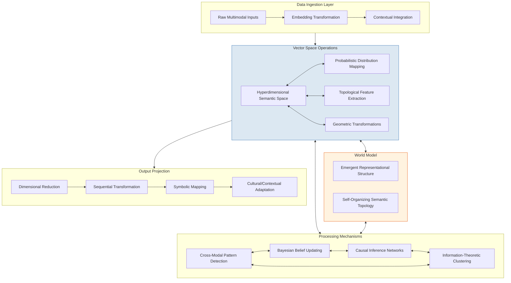

```mermaid
flowchart TD
    subgraph Data["Data Ingestion Layer"]
        D1[Raw Multimodal Inputs] --> D2[Embedding Transformation]
        D2 --> D3[Contextual Integration]
    end
    
    subgraph Vector["Vector Space Operations"]
        V1[Hyperdimensional Semantic Space]
        V2[Probabilistic Distribution Mapping]
        V3[Topological Feature Extraction]
        V4[Geometric Transformations]
        
        V1 <--> V2
        V1 <--> V3
        V1 <--> V4
    end
    
    subgraph Process["Processing Mechanisms"]
        P1[Cross-Modal Pattern Detection]
        P2[Bayesian Belief Updating]
        P3[Causal Inference Networks]
        P4[Information-Theoretic Clustering]
        
        P1 <--> P2
        P2 <--> P3
        P3 <--> P4
        P4 <--> P1
    end
    
    subgraph Model["World Model"]
        M1[Emergent Representational Structure]
        M2[Self-Organizing Semantic Topology]
    end
    
    subgraph Output["Output Projection"]
        O1[Dimensional Reduction]
        O2[Sequential Transformation]
        O3[Symbolic Mapping]
        O4[Cultural/Contextual Adaptation]
        
        O1 --> O2
        O2 --> O3
        O3 --> O4
    end
    
    Data --> Vector
    Vector <--> Process
    Vector <--> Model
    Model <--> Process
    Vector --> Output
    
    style Vector fill:#DCE8F2,stroke:#2B6CB0
    style Model fill:#FFF3E0,stroke:#E65100
```

