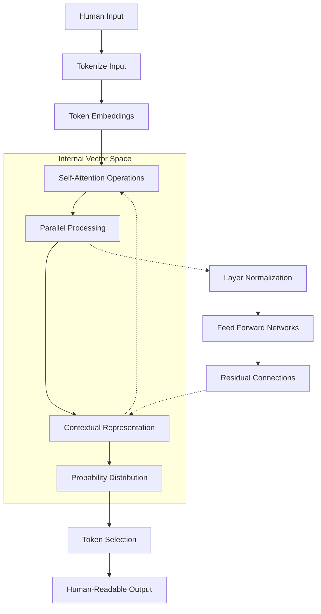

```mermaid
flowchart TD
    input[Human Input] --> tokenize[Tokenize Input]
    tokenize --> embed[Token Embeddings]
    embed --> attn[Self-Attention Operations]
    
    subgraph internal[Internal Vector Space]
        attn --> parallel[Parallel Processing]
        parallel --> context[Contextual Representation]
        context --> distribute[Probability Distribution]
    end
    
    distribute --> select[Token Selection]
    select --> output[Human-Readable Output]
    
    %% Hidden operations
    parallel -.-> norm[Layer Normalization]
    norm -.-> ffn[Feed Forward Networks]
    ffn -.-> residual[Residual Connections]
    residual -.-> context
    
    %% Key feature: Feedback loops
    context -.-> attn
```
