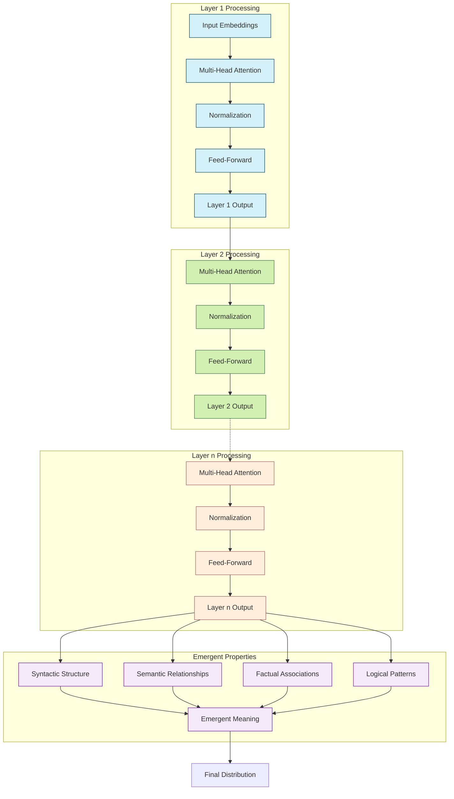

```mermaid
flowchart TD
    subgraph "Layer 1 Processing"
        L1I[Input Embeddings] --> L1A[Multi-Head Attention]
        L1A --> L1N[Normalization]
        L1N --> L1F[Feed-Forward]
        L1F --> L1O[Layer 1 Output]
    end
    
    subgraph "Layer 2 Processing"
        L1O --> L2A[Multi-Head Attention]
        L2A --> L2N[Normalization]
        L2N --> L2F[Feed-Forward]
        L2F --> L2O[Layer 2 Output]
    end
    
    subgraph "Layer n Processing"
        L2O -.-> LnA[Multi-Head Attention]
        LnA --> LnN[Normalization]
        LnN --> LnF[Feed-Forward]
        LnF --> LnO[Layer n Output]
    end
    
    subgraph "Emergent Properties"
        LnO --> EP1[Syntactic Structure]
        LnO --> EP2[Semantic Relationships]
        LnO --> EP3[Factual Associations]
        LnO --> EP4[Logical Patterns]
        
        EP1 & EP2 & EP3 & EP4 --> EM[Emergent Meaning]
    end
    
    EM --> Output[Final Distribution]
    
    classDef layer1 fill:#D4F1F9,stroke:#05445E
    classDef layer2 fill:#D1F0B1,stroke:#3F704D
    classDef layern fill:#FFEEDB,stroke:#A75D5D
    classDef emergent fill:#F3E9F9,stroke:#6A1B9A
    
    class L1I,L1A,L1N,L1F,L1O layer1
    class L2A,L2N,L2F,L2O layer2
    class LnA,LnN,LnF,LnO layern
    class EP1,EP2,EP3,EP4,EM emergent
```

