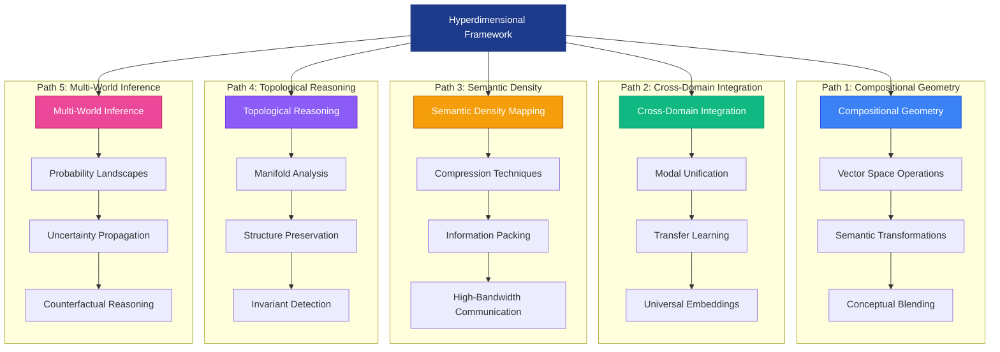

```mermaid
flowchart TD
    root[Hyperdimensional Framework] --> path1[Compositional Geometry]
    root --> path2[Cross-Domain Integration]
    root --> path3[Semantic Density Mapping]
    root --> path4[Topological Reasoning]
    root --> path5[Multi-World Inference]
    
    subgraph "Path 1: Compositional Geometry"
        path1 --> comp1[Vector Space Operations]
        comp1 --> comp2[Semantic Transformations]
        comp2 --> comp3[Conceptual Blending]
    end
    
    subgraph "Path 2: Cross-Domain Integration"
        path2 --> cross1[Modal Unification]
        cross1 --> cross2[Transfer Learning]
        cross2 --> cross3[Universal Embeddings]
    end
    
    subgraph "Path 3: Semantic Density"
        path3 --> dens1[Compression Techniques]
        dens1 --> dens2[Information Packing]
        dens2 --> dens3[High-Bandwidth Communication]
    end
    
    subgraph "Path 4: Topological Reasoning"
        path4 --> topo1[Manifold Analysis]
        topo1 --> topo2[Structure Preservation]
        topo2 --> topo3[Invariant Detection]
    end
    
    subgraph "Path 5: Multi-World Inference"
        path5 --> multi1[Probability Landscapes]
        multi1 --> multi2[Uncertainty Propagation]
        multi2 --> multi3[Counterfactual Reasoning]
    end
    
    style root fill:#1E3A8A,color:#FFFFFF,stroke:#1E3A8A
    style path1 fill:#3B82F6,color:#FFFFFF,stroke:#1D4ED8
    style path2 fill:#10B981,color:#FFFFFF,stroke:#059669
    style path3 fill:#F59E0B,color:#FFFFFF,stroke:#B45309
    style path4 fill:#8B5CF6,color:#FFFFFF,stroke:#6D28D9
    style path5 fill:#EC4899,color:#FFFFFF,stroke:#BE185D
```
