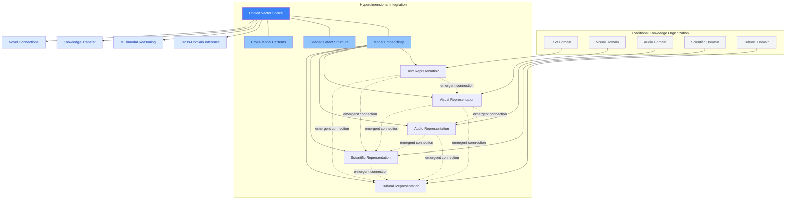

```mermaid
flowchart TD
    subgraph "Traditional Knowledge Organization"
        T1[Text Domain]
        T2[Visual Domain]
        T3[Audio Domain]
        T4[Scientific Domain]
        T5[Cultural Domain]
        
        %% Notice the separate, disconnected domains
    end
    
    subgraph "Hyperdimensional Integration"
        H[Unified Vector Space] --- M1[Modal Embeddings]
        H --- M2[Shared Latent Structure]
        H --- M3[Cross-Modal Patterns]
        
        M1 --> D1[Text Representation]
        M1 --> D2[Visual Representation]
        M1 --> D3[Audio Representation]
        M1 --> D4[Scientific Representation]
        M1 --> D5[Cultural Representation]
        
        %% Connections between domains emerge naturally
        D1 -.->|emergent connection| D2
        D2 -.->|emergent connection| D3
        D1 -.->|emergent connection| D4
        D3 -.->|emergent connection| D5
        D4 -.->|emergent connection| D5
        D2 -.->|emergent connection| D5
        D1 -.->|emergent connection| D5
        D2 -.->|emergent connection| D4
        D3 -.->|emergent connection| D4
    end
    
    %% Showing transition from traditional to unified
    T1 --> D1
    T2 --> D2
    T3 --> D3
    T4 --> D4
    T5 --> D5
    
    %% Novel capabilities that emerge
    H --> C1[Cross-Domain Inference]
    H --> C2[Multimodal Reasoning]
    H --> C3[Knowledge Transfer]
    H --> C4[Novel Connections]
    
    style H fill:#3B82F6,color:#FFFFFF,stroke-width:2px
    style M1 fill:#93C5FD,color:#1E3A8A,stroke-width:1px
    style M2 fill:#93C5FD,color:#1E3A8A,stroke-width:1px
    style M3 fill:#93C5FD,color:#1E3A8A,stroke-width:1px

    style C1 fill:#DBEAFE,color:#1E40AF,stroke-width:1px
    style C2 fill:#DBEAFE,color:#1E40AF,stroke-width:1px
    style C3 fill:#DBEAFE,color:#1E40AF,stroke-width:1px
    style C4 fill:#DBEAFE,color:#1E40AF,stroke-width:1px

    style T1 fill:#F3F4F6,color:#4B5563,stroke-width:1px
	style T2 fill:#F3F4F6,color:#4B5563,stroke-width:1px
	style T3 fill:#F3F4F6,color:#4B5563,stroke-width:1px
	style T4 fill:#F3F4F6,color:#4B5563,stroke-width:1px
	style T5 fill:#F3F4F6,color:#4B5563,stroke-width:1px
```
