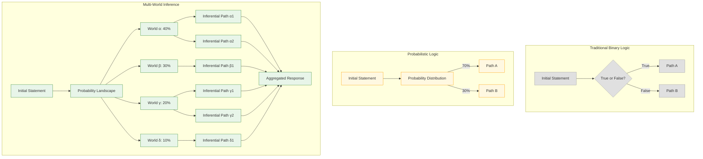

```mermaid
flowchart TD
    subgraph "Traditional Binary Logic"
        TB[Initial Statement] --> TB1{True or False?}
        TB1 -->|True| TB2[Path A]
        TB1 -->|False| TB3[Path B]
    end
    
    subgraph "Probabilistic Logic"
        PB[Initial Statement] --> PB1[Probability Distribution]
        PB1 -->|70%| PB2[Path A]
        PB1 -->|30%| PB3[Path B]
    end
    
    subgraph "Multi-World Inference"
        MW[Initial Statement] --> MW1[Probability Landscape]
        
        MW1 --> MW2[World α: 40%]
        MW1 --> MW3[World β: 30%]
        MW1 --> MW4[World γ: 20%]
        MW1 --> MW5[World δ: 10%]
        
        MW2 --> MW6[Inferential Path α1]
        MW2 --> MW7[Inferential Path α2]
        
        MW3 --> MW8[Inferential Path β1]
        
        MW4 --> MW9[Inferential Path γ1]
        MW4 --> MW10[Inferential Path γ2]
        
        MW5 --> MW11[Inferential Path δ1]
        
        MW6 & MW7 & MW8 & MW9 & MW10 & MW11 --> MWR[Aggregated Response]
    end
    
    classDef traditional fill:#E0E0E0,stroke:#9E9E9E
    classDef probabilistic fill:#FFF8E1,stroke:#FFA000
    classDef multiworld fill:#E8F5E9,stroke:#388E3C
    
    class TB,TB1,TB2,TB3 traditional
    class PB,PB1,PB2,PB3 probabilistic
    class MW,MW1,MW2,MW3,MW4,MW5,MW6,MW7,MW8,MW9,MW10,MW11,MWR multiworld
```
