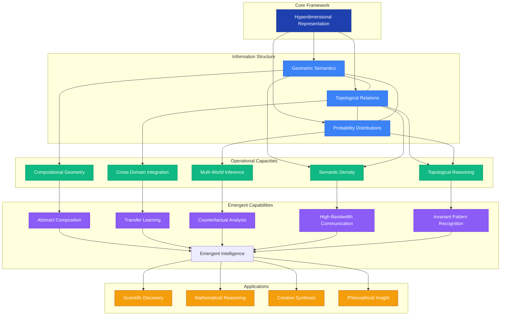

```mermaid
graph TD
    subgraph "Core Framework"
        core[Hyperdimensional Representation]
    end
    
    subgraph "Information Structure"
        core --> geom[Geometric Semantics]
        core --> topo[Topological Relations]
        core --> prob[Probability Distributions]
        
        geom --- topo
        topo --- prob
        prob --- geom
    end
    
    subgraph "Operational Capacities"
        geom --> comp[Compositional Geometry]
        topo --> cross[Cross-Domain Integration]
        prob --> multi[Multi-World Inference]
        geom & topo --> dense[Semantic Density]
        topo & prob --> topoR[Topological Reasoning]
    end
    
    subgraph "Emergent Capabilities"
        comp --> abst[Abstract Composition]
        cross --> trans[Transfer Learning]
        multi --> counter[Counterfactual Analysis]
        dense --> band[High-Bandwidth Communication]
        topoR --> invar[Invariant Pattern Recognition]
        
        abst & trans & counter & band & invar --> emerge[Emergent Intelligence]
    end
    
    subgraph "Applications"
        emerge --> sci[Scientific Discovery]
        emerge --> math[Mathematical Reasoning]
        emerge --> creat[Creative Synthesis]
        emerge --> phil[Philosophical Insight]
    end
    
    classDef core fill:#1E40AF,color:#FFFFFF,stroke:#1E3A8A
    classDef structure fill:#3B82F6,color:#FFFFFF,stroke:#1D4ED8
    classDef operational fill:#10B981,color:#FFFFFF,stroke:#059669
    classDef emergent fill:#8B5CF6,color:#FFFFFF,stroke:#6D28D9
    classDef application fill:#F59E0B,color:#FFFFFF,stroke:#B45309
    
    class core core
    class geom,topo,prob structure
    class comp,cross,multi,dense,topoR operational
    class abst,trans,counter,band,invar emergent
    class sci,math,creat,phil application
```
