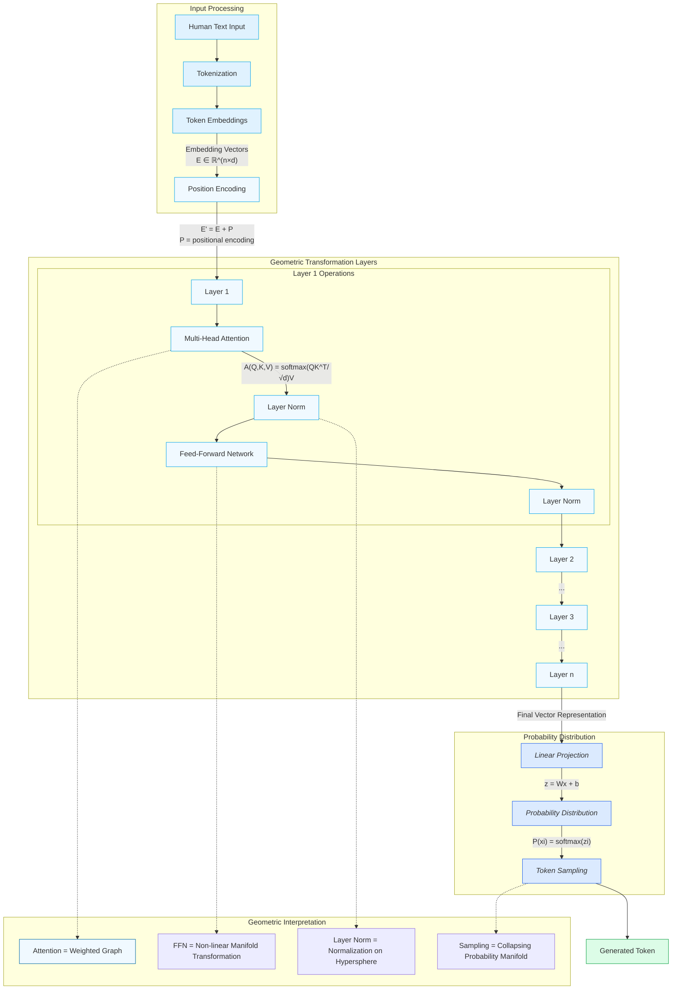

```mermaid
flowchart TD
    subgraph "Input Processing"
        input[Human Text Input] --> tokens[Tokenization]
        tokens --> embed[Token Embeddings]
        
        embed --> |"Embedding Vectors\nE ∈ ℝ^(n×d)"| pos[Position Encoding]
    end
    
    subgraph "Geometric Transformation Layers"
        pos --> |"E' = E + P\nP = positional encoding"| L1[Layer 1]
        
        subgraph "Layer 1 Operations"
            L1 --> L1A[Multi-Head Attention]
            L1A --> |"A(Q,K,V) = softmax(QK^T/√d)V"| L1N1[Layer Norm]
            L1N1 --> L1F[Feed-Forward Network]
            L1F --> L1N2[Layer Norm]
        end
        
        L1N2 --> L2[Layer 2]
        L2 --> |"..."| L3[Layer 3]
        L3 --> |"..."| Ln[Layer n]
    end
    
    subgraph "Probability Distribution"
        Ln --> |"Final Vector Representation"| proj[Linear Projection]
        proj --> |"z = Wx + b"| dist[Probability Distribution]
        dist --> |"P(xi) = softmax(zi)"| sample[Token Sampling]
    end
    
    subgraph "Geometric Interpretation"
        style interp fill:#f0f9ff,stroke:#0369a1
        interp[Attention = Weighted Graph]
        interp2[FFN = Non-linear Manifold Transformation]
        interp3[Layer Norm = Normalization on Hypersphere]
        interp4[Sampling = Collapsing Probability Manifold]
    end
    
    L1A -.-> interp
    L1F -.-> interp2
    L1N1 -.-> interp3
    sample -.-> interp4
    
    sample --> output[Generated Token]
    
    classDef input fill:#e0f2fe,stroke:#0ea5e9
    classDef process fill:#f0f9ff,stroke:#0ea5e9
    classDef math fill:#dbeafe,stroke:#2563eb,font-style:italic
    classDef output fill:#dcfce7,stroke:#16a34a
    
    class input,tokens,embed input
    class pos,L1,L1A,L1N1,L1F,L1N2,L2,L3,Ln process
    class proj,dist,sample math
    class output output
```
