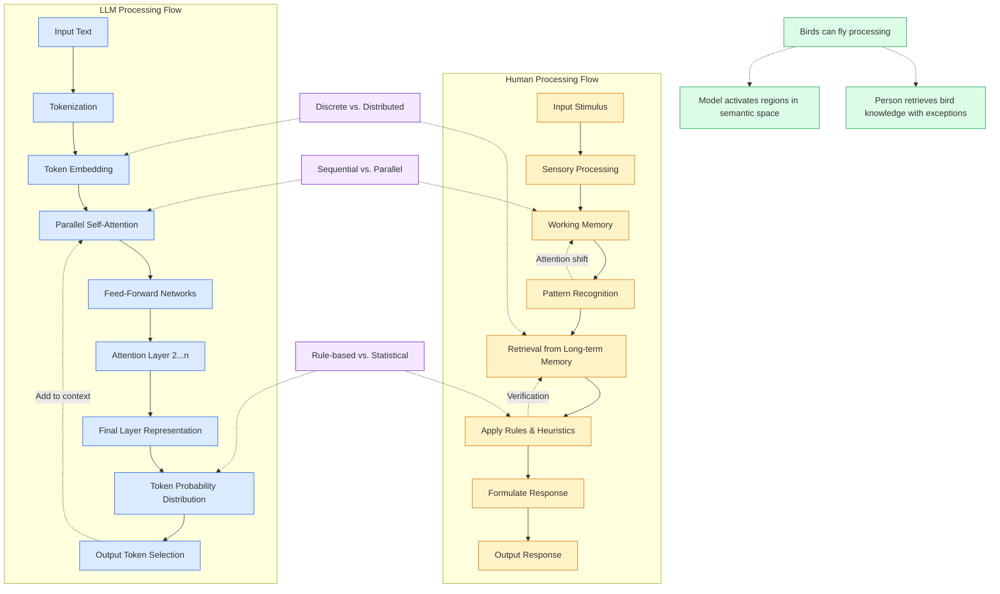

```mermaid
flowchart TD
    subgraph "Human Processing Flow"
        H1[Input Stimulus] --> H2[Sensory Processing]
        H2 --> H3[Working Memory]
        H3 --> H4[Pattern Recognition]
        H4 --> H5[Retrieval from Long-term Memory]
        H5 --> H6[Apply Rules & Heuristics]
        H6 --> H7[Formulate Response]
        H7 --> H8[Output Response]
        
        %% Feedback loops
        H6 -.-> |"Verification"| H5
        H4 -.-> |"Attention shift"| H3
    end
    
    subgraph "LLM Processing Flow"
        L1[Input Text] --> L2[Tokenization]
        L2 --> L3[Token Embedding]
        L3 --> L4[Parallel Self-Attention]
        L4 --> L5[Feed-Forward Networks]
        
        %% Multiple layers
        L5 --> L6[Attention Layer 2...n]
        L6 --> L7[Final Layer Representation]
        L7 --> L8[Token Probability Distribution]
        L8 --> L9[Output Token Selection]
        
        %% Loop for next token
        L9 -.-> |"Add to context"| L4
    end
    
    %% Key differences
    diff1[Sequential vs. Parallel] -.-> H3
    diff1 -.-> L4
    
    diff2[Discrete vs. Distributed] -.-> H5
    diff2 -.-> L3
    
    diff3[Rule-based vs. Statistical] -.-> H6
    diff3 -.-> L8
    
    %% Concrete example paths
    example["Birds can fly" processing] -.-> H_path[Person retrieves bird knowledge with exceptions]
    example -.-> L_path[Model activates regions in semantic space]
    
    style H1 fill:#fef3c7,stroke:#d97706
    style H2 fill:#fef3c7,stroke:#d97706
    style H3 fill:#fef3c7,stroke:#d97706
    style H4 fill:#fef3c7,stroke:#d97706
    style H5 fill:#fef3c7,stroke:#d97706
    style H6 fill:#fef3c7,stroke:#d97706
    style H7 fill:#fef3c7,stroke:#d97706
    style H8 fill:#fef3c7,stroke:#d97706

    style L1 fill:#dbeafe,stroke:#2563eb
    style L2 fill:#dbeafe,stroke:#2563eb
    style L3 fill:#dbeafe,stroke:#2563eb
    style L4 fill:#dbeafe,stroke:#2563eb
    style L5 fill:#dbeafe,stroke:#2563eb
    style L6 fill:#dbeafe,stroke:#2563eb
    style L7 fill:#dbeafe,stroke:#2563eb
    style L8 fill:#dbeafe,stroke:#2563eb
    style L9 fill:#dbeafe,stroke:#2563eb
    
    style diff1 fill:#f3e8ff,stroke:#7e22ce
    style diff2 fill:#f3e8ff,stroke:#7e22ce
    style diff3 fill:#f3e8ff,stroke:#7e22ce
    
    style example fill:#dcfce7,stroke:#16a34a
    style H_path fill:#dcfce7,stroke:#16a34a
    style L_path fill:#dcfce7,stroke:#16a34a
```
