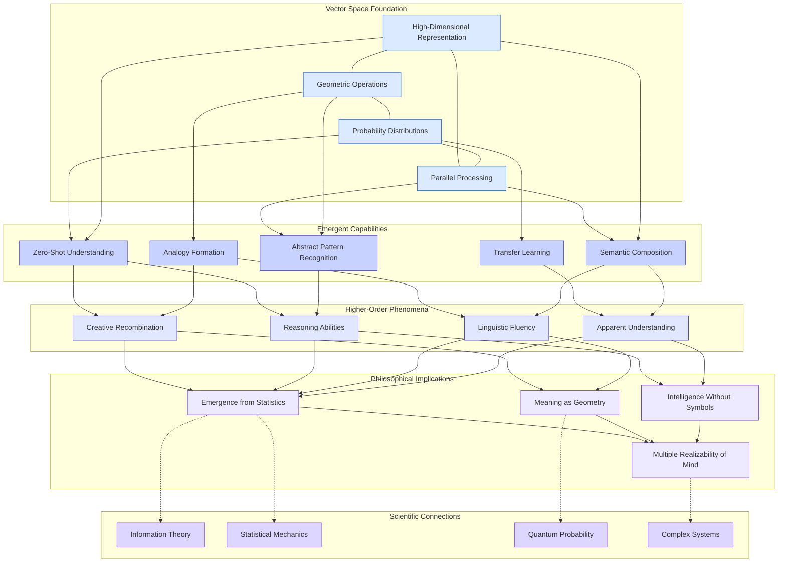

```mermaid
flowchart TD
    subgraph "Vector Space Foundation"
        VF1[High-Dimensional Representation]
        VF2[Geometric Operations]
        VF3[Probability Distributions]
        VF4[Parallel Processing]
        
        VF1 --- VF2
        VF2 --- VF3
        VF3 --- VF4
        VF4 --- VF1
    end
    
    subgraph "Emergent Capabilities"
        EC1[Semantic Composition]
        EC2[Analogy Formation]
        EC3[Transfer Learning]
        EC4[Abstract Pattern Recognition]
        EC5[Zero-Shot Understanding]
        
        VF1 --> EC1
        VF1 --> EC5
        VF2 --> EC2
        VF2 --> EC4
        VF3 --> EC3
        VF3 --> EC5
        VF4 --> EC1
        VF4 --> EC4
    end
    
    subgraph "Higher-Order Phenomena"
        HP1[Apparent Understanding]
        HP2[Linguistic Fluency]
        HP3[Reasoning Abilities]
        HP4[Creative Recombination]
        
        EC1 --> HP1
        EC3 --> HP1
        
        EC1 --> HP2
        EC2 --> HP2
        
        EC4 --> HP3
        EC5 --> HP3
        
        EC2 --> HP4
        EC5 --> HP4
    end
    
    subgraph "Philosophical Implications"
        PI1[Intelligence Without Symbols]
        PI2[Meaning as Geometry]
        PI3[Emergence from Statistics]
        PI4[Multiple Realizability of Mind]
        
        HP1 --> PI1
        HP3 --> PI1
        
        HP2 --> PI2
        HP4 --> PI2
        
        HP1 --> PI3
        HP2 --> PI3
        HP3 --> PI3
        HP4 --> PI3
        
        PI1 --> PI4
        PI2 --> PI4
        PI3 --> PI4
    end
    
    subgraph "Scientific Connections"
        SC1[Information Theory]
        SC2[Statistical Mechanics]
        SC3[Quantum Probability]
        SC4[Complex Systems]
        
        PI3 -.-> SC1
        PI3 -.-> SC2
        PI2 -.-> SC3
        PI4 -.-> SC4
    end
    
	style VF1 fill:#dbeafe,stroke:#2563eb
	style VF2 fill:#dbeafe,stroke:#2563eb
	style VF3 fill:#dbeafe,stroke:#2563eb
	style VF4 fill:#dbeafe,stroke:#2563eb
	
	style EC1 fill:#c7d2fe,stroke:#4f46e5
	style EC2 fill:#c7d2fe,stroke:#4f46e5
	style EC3 fill:#c7d2fe,stroke:#4f46e5
	style EC4 fill:#c7d2fe,stroke:#4f46e5
	style EC5 fill:#c7d2fe,stroke:#4f46e5
	
	style HP1 fill:#e0e7ff,stroke:#3730a3
	style HP2 fill:#e0e7ff,stroke:#3730a3
	style HP3 fill:#e0e7ff,stroke:#3730a3
	style HP4 fill:#e0e7ff,stroke:#3730a3
	
	style PI1 fill:#ede9fe,stroke:#6d28d9
	style PI2 fill:#ede9fe,stroke:#6d28d9
	style PI3 fill:#ede9fe,stroke:#6d28d9
	style PI4 fill:#ede9fe,stroke:#6d28d9
	
	style SC1 fill:#ddd6fe,stroke:#7c3aed
	style SC2 fill:#ddd6fe,stroke:#7c3aed
	style SC3 fill:#ddd6fe,stroke:#7c3aed
	style SC4 fill:#ddd6fe,stroke:#7c3aed
```
